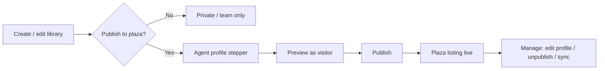
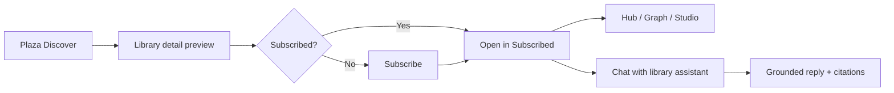

# Plaza library as scoped agent — product & web interaction spec

**Scope:** Web shell (`MindAppWeb`, `/web`). English UI copy throughout.

A **plaza library** is not only a folder of sources — it ships with a **bound agent profile** so subscribers get a grounded, persona-shaped assistant instead of a generic chatbot or a read-only archive.

---

## 1. Problem framing

### Pain points

| Pain | Why it hurts | What the bound agent solves |
|------|----------------|-----------------------------|
| **Library ≠ assistant** | Users subscribe, then stall: they do not know what to ask or how deep to go. | Publisher defines **example questions**, **capabilities**, and **behavior skills** up front. |
| **Generic agents feel untrustworthy** | Answers may hallucinate or ignore the library. | **Grounding + disclaimer** are visible before and during chat; replies are scoped to library sources. |
| **Expert knowledge does not scale** | One senior’s notes sit in a shared drive; juniors re-ask the same questions. | Their library becomes a **shareable twin / playbook assistant** others can subscribe to and extend in their own workspace. |
| **Creators cannot express intent** | Title + description are too thin to convey “use me for X, not Y”. | **Tagline**, **capability chips**, and derived **“What it can do”** from skills replace raw instruction dumps. |
| **Studio output stays private** | Subscribers see sources but not finished artifacts (reports, audio, slides). | **Share Studio outputs** toggle makes the content factory a public showcase and remix surface. |
| **Stale libraries erode trust** | Plaza cards feel abandoned; chat answers reflect old material. | **Update frequency** on plaza cards + **“Materials synced”** in chat set expectations. |

### Strong use cases

1. **Personal digital twin** — Essays, talks, and quotes → “Ask how I would frame this decision” with tone and citations from the corpus.
2. **Top performer playbook** — Sales / PM / design lead’s decks and retros → junior teammates subscribe for coaching-style Q&A grounded in real wins.
3. **Curriculum tutor** — Exam prep library + study-mode skills → students get flashcards, summaries, and mistake patterns, not open-web answers.
4. **Compliance / legal lens** — Policy corpus + strict grounding disclaimer → answers stay in-corpus; footer reminds users it is not legal advice.
5. **Team onboarding buddy** — Internal runbooks + FAQ skill → new hires ask process questions before pinging humans.
6. **Creator studio + library bundle** — Public KB + shared factory outputs → subscribers browse sources *and* remix published reports/slides.

---

## 2. Configuration model

Extends `PublicKbSettings` (`lib/public-kb-settings.ts`) and plaza row metadata (`PlazaLibraryRow`).

```ts
type PublicKbAgentProfile = {
  // Identity
  boundAgentId: number | null
  boundAgentName: string          // internal agent record name
  displayName: string             // public “Library assistant” name (rename allowed)

  // Discovery
  tagline: string                 // one-line scenario (≤ 80 chars)
  capabilities: string[]          // 3–4 short tags, e.g. "Exam prep", "Cited answers"

  // Behavior (publisher-facing)
  skills: PublicKbAgentSkill[]    // label + instruction (not shown verbatim to visitors)

  // Trust
  groundingMode: "library-only" | "library-preferred"
  disclaimer: string              // e.g. “Not medical advice. Answers cite library sources only.”

  // Studio
  shareFactoryOutputsWithEveryone: boolean

  // Freshness
  updateCadence?: "daily" | "weekly" | "monthly" | "manual"
  lastSyncedAt?: string           // ISO; drives plaza badge + chat sync note
}

type PublicKbSettings = {
  isPublic: boolean
  agent: PublicKbAgentProfile
  exampleQuestions: string[]      // 2–4; empty → fall back to getKbAgentSuggestions()
}
```

### Publisher input → subscriber surfacing

| Config field | Publisher fills in | Subscriber sees |
|--------------|-------------------|-----------------|
| `boundAgentId` + `displayName` | Pick base agent; optional rename for plaza | Detail **Library assistant** card; chat header avatar + name |
| `tagline` | One-line scenario | Plaza card subtitle; detail under title; chat hero subtitle |
| `capabilities` | 3–4 tags (preset + custom) | Detail chips; plaza list one-line summary (`tagline · chip · chip`) |
| `skills[].instruction` | Behavior instructions per skill | **Not** shown raw; UI derives **“What it can do”** bullet list from skill labels + short derived blurbs |
| `exampleQuestions` | 2–4 prompts | Detail **Try asking** section; chat empty-state suggestion rail |
| `groundingMode` + `disclaimer` | Boundary & compliance copy | Detail **Trust & scope** block; chat footer (persistent, 1 line + “Learn more”) |
| `shareFactoryOutputsWithEveryone` | Toggle | Studio tab subtitle: “Public remix gallery” vs “Members only” |
| `updateCadence` / `lastSyncedAt` | Optional cadence + auto on ingest | Plaza **Updated today** badge; assistant card “Materials synced · {date}” |

---

## 3. Closed-loop journeys

### 3.1 Publisher — configure & publish



**Entry points**

- **Create library dialog** (`WebCreateKbDialog`) — when category = personal or team, expand **Publish to plaza** section (existing `WebPublicKbSettingsFields`, extended).
- **Library overflow → Publish settings** — for libraries already created.
- **Knowledge detail (owner, unpublished)** — banner: “Turn this library into a plaza assistant” → same settings panel.

**Agent profile stepper (4 steps, single scroll panel acceptable on web)**

1. **Assistant identity** — Agent select, display name, tagline.
2. **Capabilities & behavior** — Capability chips (max 4); skills (presets + custom); live **“What it can do”** preview (derived, read-only).
3. **Conversation starters** — 2–4 example questions; optional “Generate from skills” button.
4. **Trust & sharing** — Grounding mode, disclaimer template picker + edit, Studio public toggle, update cadence.

**Validation before publish**

- `boundAgentId`, `displayName`, `tagline` required.
- ≥ 1 skill OR ≥ 1 capability.
- ≥ 2 example questions.
- Disclaimer required if `groundingMode === "library-only"`.

**On publish success**

- Toast: `"{name}" is live on the plaza with assistant "{displayName}".`
- Library moves to **Published** subsection under Personal (owner) or shows **Published** badge on team KB.
- Plaza index receives row: title, tagline, capabilities summary, subscriber count, `lastSyncedAt`.

**Owner manage state (detail, owner only)**

- **Edit publish profile** — reopens stepper; saves incrementally.
- **Unpublish** — confirm; removes from plaza; subscribers keep read-only archive + “Publisher removed this library” banner.
- **Sync now** — triggers re-index; updates `lastSyncedAt`; subscribers see sync note on next chat open.

---

### 3.2 Visitor / subscriber — discover → subscribe → use



#### Plaza Discover (`WebPlazaDiscoverPage`)

**Card layout (compact + featured)**

- Cover, title, **tagline** (1 line).
- Meta line: `{capabilities[0]} · {capabilities[1]} · {subscriberCount} subscribers`.
- Freshness pill when `lastSyncedAt` is today/yesterday: **Updated today**.
- Optional verified publisher badge.

**Search** matches title, tagline, capabilities, author handle.

**Tap card** → opens **public library detail** in main pane (not auto-subscribe).

#### Public library detail (`KnowledgeDetail`, `isPublicKb`)

**Header**

- Title, publisher row, tagline, content / subscriber / view counts.
- Primary CTA: **Subscribe** (or **Subscribed ✓** with overflow → Unsubscribe).
- Secondary CTA: **Chat with assistant** (enabled after subscribe; before subscribe → modal: “Subscribe to chat with {displayName}”).

**Library assistant section** (above Hub tabs)

- Avatar (agent), **displayName**, tagline repeat.
- Capability chips.
- **What it can do** — 3 bullets max, derived from skills (labels + one-line blurbs).
- **Try asking** — example question chips → tap opens `kb-agent-chat` with prefilled prompt.
- **Trust & scope** — grounding mode icon + disclaimer excerpt + “Full policy”.
- Sync line: `Materials synced · Mar 12, 2026` when `lastSyncedAt` set.

**Tabs**

- **Hub / Graph** — optional browse preview: first N sources visible, blur rest + subscribe CTA.
- **Studio** — if `shareFactoryOutputsWithEveryone`: public factory gallery + “Remix in your workspace” (creates private copy job scoped to subscribed library). Else: locked state explaining members-only outputs.

**Social row** (existing like / comment) — unchanged.

#### Subscribed list (`WebKnowledgeBrowser` → Subscribed)

- Group **Followed** (plaza subscriptions) vs **Published** (owner’s live plaza libraries).
- Row shows assistant display name as subtitle when different from library title: `History essentials · Assistant: Exam Coach`.

#### Library-scoped chat (`kb-agent-chat` / `WebAgentWorkspace` + `LibraryChatLaunchContext`)

**Header**

- `{displayName}` + small “Scoped to {libraryTitle}” subtitle.
- Library cover thumbnail; overflow → View library, Unsubscribe.

**Empty state**

- Tagline one line.
- `KbAgentSuggestionRail` populated from `exampleQuestions` (publisher) else `getKbAgentSuggestions()`.
- Composer placeholder: `Ask {displayName} about {libraryTitle}…`

**During chat**

- System message (first turn only, collapsible): grounding summary + link to Trust & scope.
- Replies cite library sources when grounding applies.

**Footer (persistent)**

- `{disclaimer}` truncated; tap **Learn more** opens Trust sheet.

**After publisher sync**

- Banner once per session: `Materials synced — answers may include newer sources.`

---

## 4. State matrix (real closed loop)

| User state | Plaza | Detail | Chat | Studio |
|------------|-------|--------|------|--------|
| Anonymous (demo: signed in) | Browse all | Preview sources (cap N), assistant card visible, Subscribe CTA | Blocked → subscribe modal | Public outputs visible if flag on |
| Subscribed, not owner | Discover + search | Full Hub/Graph; Chat enabled | Full scoped chat + footer disclaimer | Remix if public outputs |
| Owner, published | Own card marked **Yours** | Edit profile; Unpublish; Sync | Same chat + “Preview as visitor” toggle | All outputs; public toggle in settings |
| Owner, unpublished | Not listed | Publish banner + stepper | Local agent chat (private scope) | Private only |
| Unpublished by owner (subscriber) | Removed from plaza | Read-only + banner | Chat disabled; history read-only | Locked |

**Persistence (backend targets)**

- `POST /api/v1/knowledge-bases/{id}/publish` — body: `PublicKbSettings` + profile fields.
- `POST /api/v1/knowledge-bases/{id}/subscribe` / `DELETE …/subscribe`
- `GET /api/v1/plaza/libraries` — cursor list with agent summary fields for cards.
- `GET /api/v1/knowledge-bases/{id}/agent-profile` — public profile for detail + chat bootstrap.
- Chat session: `{ kbId, agentId, displayName, skills[], groundingMode, disclaimer }` injected into agent system prompt server-side (instructions never returned verbatim to client).

---

## 5. UI components to extend (implementation checklist)

| Component | Change |
|-----------|--------|
| `lib/public-kb-settings.ts` | Add `displayName`, `tagline`, `capabilities`, `exampleQuestions`, `groundingMode`, `disclaimer`, `updateCadence`, `lastSyncedAt`; helper `deriveWhatItCanDo(skills)` |
| `WebPublicKbSettingsFields` | Stepper sections per §3.1; capability chip input; example question list; disclaimer templates; preview panel |
| `WebPlazaDiscoverPage` | Card: tagline, capability summary, freshness badge |
| `mock-plaza-libraries.ts` | Seed `boundAgentDisplayName`, `capabilities`, `exampleQuestions`, `lastUpdate` aligned with profile |
| `plazaRowToKnowledgeBase` | Map profile onto `KnowledgeBase.publicSettings` + `publicTagline` |
| `KnowledgeDetail` (public) | Library assistant section, Trust block, subscribe gating for chat |
| `getKbAgentSuggestions` | Prefer `recommendedQuestions` / `exampleQuestions` from public profile |
| `WebAgentWorkspace` / chat header | Accept `libraryAssistant?: { displayName, tagline, disclaimer }` |
| `web-knowledge-browser` | Subscribed grouping copy; publish toast uses `displayName` |

---

## 6. Copy templates (English)

**Disclaimer presets**

- General: `Answers use this library’s sources only and may be incomplete. Verify before acting.`
- Education: `Study aid only — not an official exam or institution endorsement.`
- Health: `Not medical advice. Consult a qualified professional.`
- Legal: `Not legal advice. Information is drawn from uploaded materials only.`

**Empty chat rail fallback** (when publisher omitted examples)

- `Summarize this library in five bullets with citations.`
- `What are the most important ideas for a newcomer?`
- `Compare two sources and note where they disagree.`

**Studio tab (public outputs on)**

- Subtitle: `Public Studio — reports and media you can view and remix into your workspace.`

**Studio tab (public outputs off)**

- Subtitle: `Studio outputs are private to the publisher’s team.`

---

## 7. Success metrics

- **Publish completion rate** — started stepper → live on plaza.
- **Subscribe → first chat** — % subscribers who send ≥1 message within 7 days.
- **Example question CTR** — chip taps vs manual compose.
- **Unsubscribe after stale** — correlate with missing `lastSyncedAt` updates.

---

## 8. Related docs

- [04-knowledge-tab.md](./04-knowledge-tab.md) — Library browser & plaza entry
- [05-knowledge-detail.md](./05-knowledge-detail.md) — Hub / Graph / Studio
- [07-agent-chat.md](./07-agent-chat.md) — Agent & library-scoped chat
