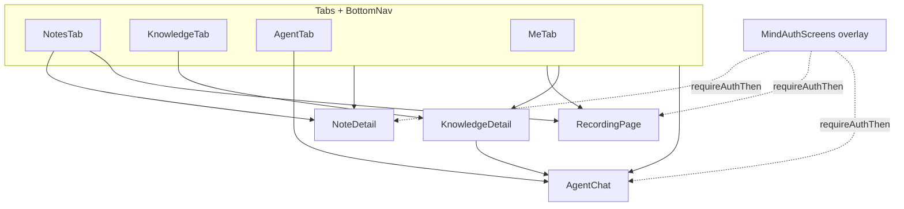

# Mind v2 原型 — 页面级开发文档

本目录按**可导航页面 / 全屏视图**拆分说明：**功能边界**、**输入（Props / 外部状态）**、**输出（回调 / 副作用 / 导航）**。

实现入口：`components/mind-v2/mind-app-v2.tsx`（路由壳）、`app/page.tsx`（挂载 `MindAppV2`）。

## 文档索引

| 文档 | 页面 / 视图 |
|------|----------------|
| [00-app-shell.md](./00-app-shell.md) | 设备壳、全局 `View` 路由、鉴权遮罩、底部导航 |
| [01-notes-tab.md](./01-notes-tab.md) | 笔记 Tab（列表、筛选、录音入口） |
| [02-note-detail.md](./02-note-detail.md) | 笔记详情（Source / Note、移库、分享等） |
| [03-recording.md](./03-recording.md) | 全屏录音 |
| [04-knowledge-tab.md](./04-knowledge-tab.md) | 知识库 Tab、Library Plaza |
| [05-knowledge-detail.md](./05-knowledge-detail.md) | 知识库详情（Hub / Graph / Studio、Ask、条目详情） |
| [06-agent-tab.md](./06-agent-tab.md) | Mindar / Agent Tab（首页、抽屉、资料范围、内容工厂） |
| [07-agent-chat.md](./07-agent-chat.md) | Agent 对话页（含资料库内 Chat） |
| [08-me-tab.md](./08-me-tab.md) | Me Tab（个人、设置、账户） |
| [08-me-ai-insights-prompts.md](./08-me-ai-insights-prompts.md) | Me AI 洞察：各视角提示词与数据参数 |
| [09-auth.md](./09-auth.md) | 全屏登录 / 注册（遮罩） |
| [10-shared-sheets-modals.md](./10-shared-sheets-modals.md) | 跨页面弹层与共用组件（简要） |
| [11-plaza-kb-agent.md](./11-plaza-kb-agent.md) | Plaza library as scoped agent — publish, subscribe, chat (English spec) |

## 导航关系（简图）

## 全局约定

- **Demo 数据**：笔记、文件夹、知识库列表等多为本地 mock；无真实后端。
- **鉴权**：`requireAuthThen(run)`；会话键 `sessionStorage`：`mind-v2-demo-auth`。
- **底部栏**：仅在 `currentView.type === "tabs"` 时显示。

## 后端接口文档

各页面文档末尾均含 **「后端接口开发项」** 章节（方法、路径、请求/响应、鉴权、错误码、异步任务与 Webhook）。跨页通用约定：

| 项 | 约定 |
|----|------|
| 前缀 | `/api/v1`（REST）或团队统一 BFF 前缀 |
| 鉴权 | `Authorization: Bearer <access_token>`；未登录 `401` |
| 幂等 | 写操作支持 `Idempotency-Key` 头（创建笔记、移库、扣积分） |
| 分页 | `cursor` + `limit`（默认 20，最大 100） |
| 错误体 | `{ "code": "NOTE_NOT_FOUND", "message": "...", "traceId": "..." }` |
| 流式 | Chat / 大模型回复使用 `text/event-stream` 或 WebSocket |
| 对象存储 | 上传走预签名 URL；下载走短期签名 URL |
| 多租户 | 请求头或 JWT 内 `accountId`（work / personal）与资源 `account_id` 校验 |

汇总索引见 [`DEVELOPMENT_PLAN.md`](../DEVELOPMENT_PLAN.md) 第一节；页面级明细见各 `0x-*.md` 文末。
